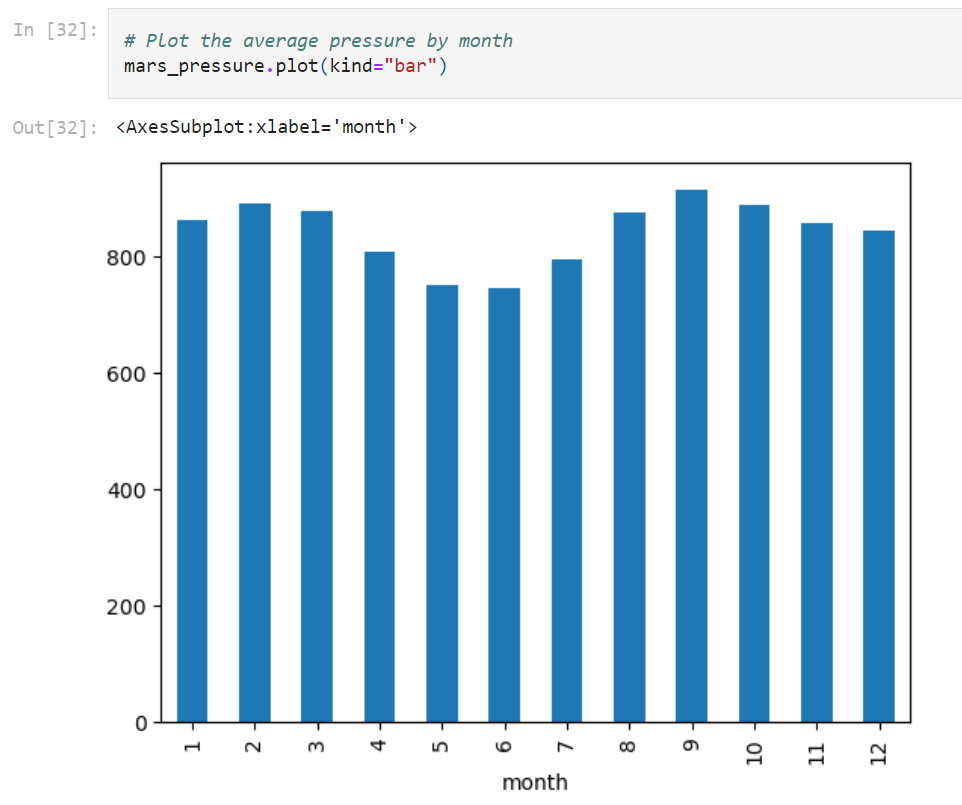
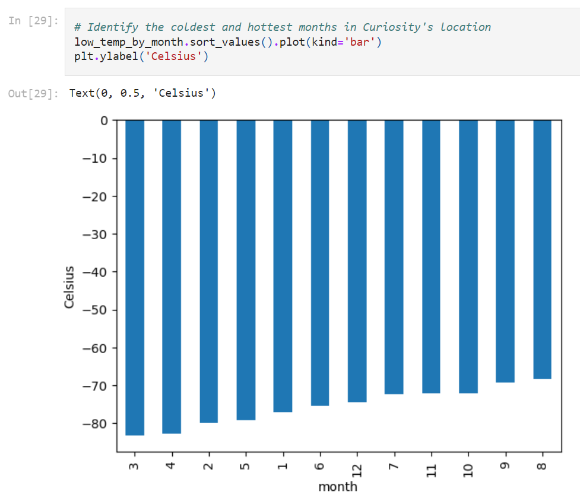
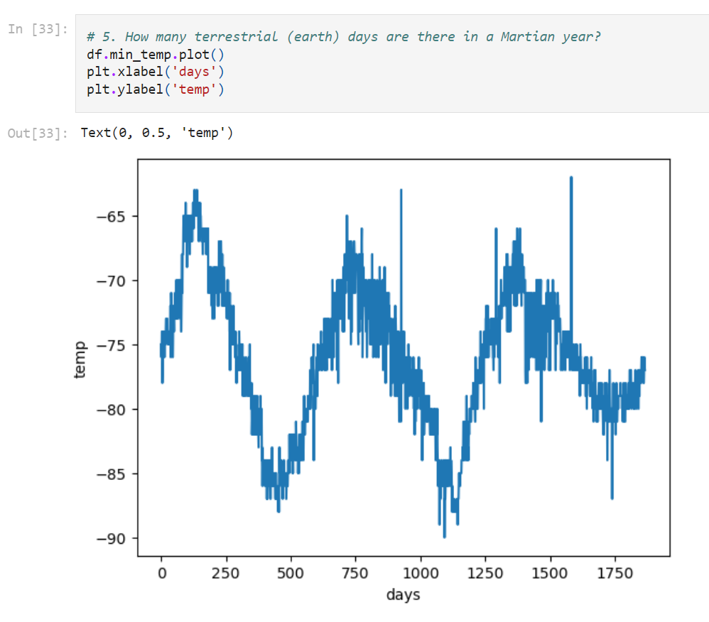

# Web-Scraping Mars Website

## Background

In this project, I worked on a web-scraping and data analysis task related to Mars. The objective was to collect data from different sources, organize and store the data, analyze it, and communicate the insights visually.

## Part 1: Scrape Titles and Preview Text from Mars News

I used the Jupyter Notebook provided in the starter code folder named `part_1_mars_news.ipynb` to perform the following steps:

1. Used automated browsing to visit the [Mars news site](https://static.bc-edx.com/data/web/mars_news/index.html) and inspected the page to identify the elements to scrape.

2. Created a Beautiful Soup object and extracted the titles and preview text of the news articles from the website.

3. Stored the scraping results in Python data structures, specifically in a list of dictionaries. Each dictionary represents a title-and-preview pair, with keys 'title' and 'preview'.

4. Printed the list in the notebook.

Optionally, I also exported the scraped data to a JSON file for sharing purposes.

## Part 2: Scrape and Analyze Mars Weather Data

I continued with the Jupyter Notebook provided in the starter code folder named `part_2_mars_weather.ipynb` for scraping and analyzing Mars weather data. The steps I followed were as follows:

1. Used automated browsing to visit the [Mars Temperature Data Site](https://static.bc-edx.com/data/web/mars_facts/temperature.html) and inspected the page to identify the elements to scrape. The URL for this page is `https://static.bc-edx.com/data/web/mars_facts/temperature.html`.

2. Created a Beautiful Soup object and scraped the data from the HTML table. I assembled the scraped data into a Pandas DataFrame with columns representing different data fields.

3. Analyzed the dataset using various Pandas functions to answer the following questions:

   - How many months exist on Mars?
   - How many Martian (and not Earth) days worth of data exist in the scraped dataset?
   - What are the coldest and the warmest months on Mars (at the location of Curiosity)?
   - Which months have the lowest and the highest atmospheric pressure on Mars?
   - About how many terrestrial (Earth) days exist in a Martian year?

4. Visualized the results by plotting the necessary charts.
 
 
 
 
5. Exported the DataFrame to a CSV file for further use and analysis.

Please refer to the actual code and the complete analysis in the provided Jupyter Notebooks for more detailed information.

